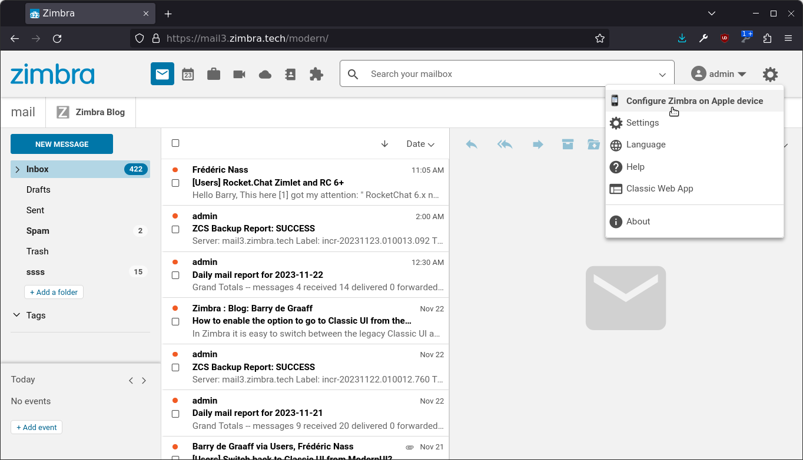
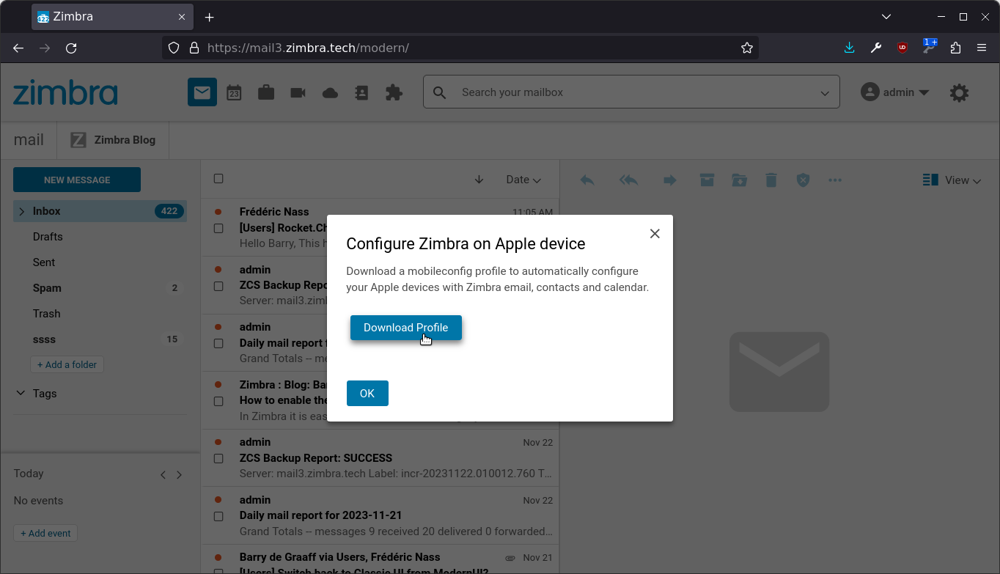
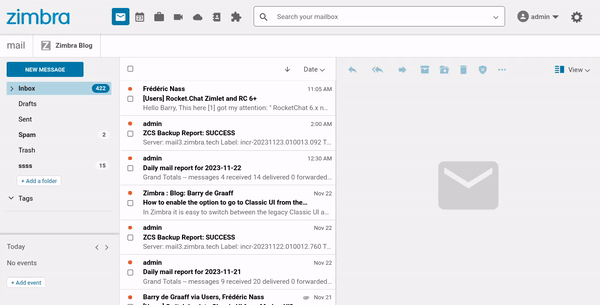

# Mobileconfig in Settings menu Zimlet

This Zimlet adds a menu option in the Settings menu to download mobileconfig file to configure your Zimbra account on Apple devices. The same is included in Modern UI by default under Settings->Accounts then expand your account and scroll down. This Zimlet exposes the feature more prominently and makes it easier to find.

## How to use profiles on your iphone or macbook

If you are an end-user interested on using profiles, please see: https://support.apple.com/en-us/102400

## Screenshots

